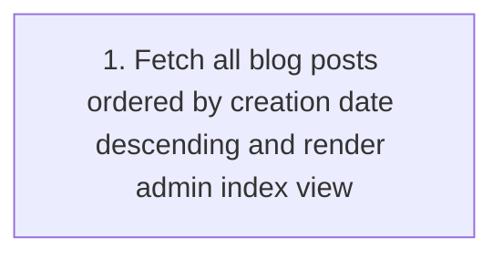
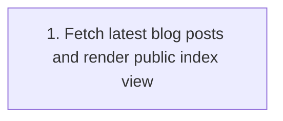
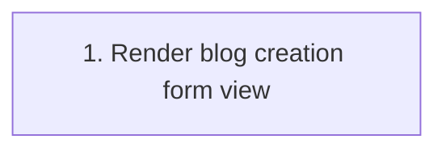
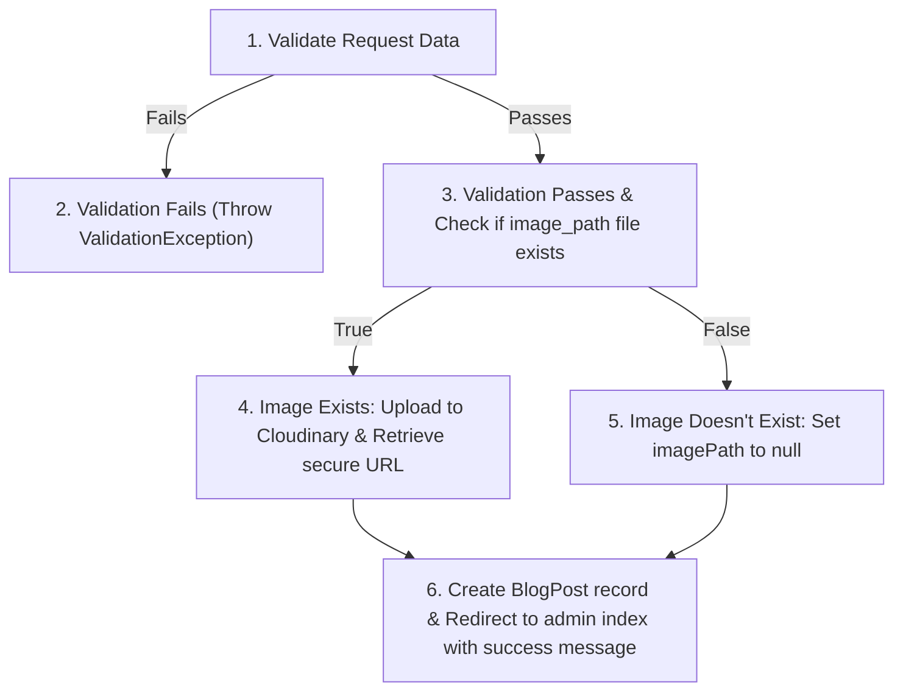
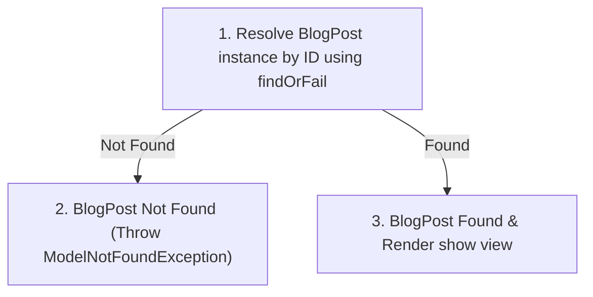
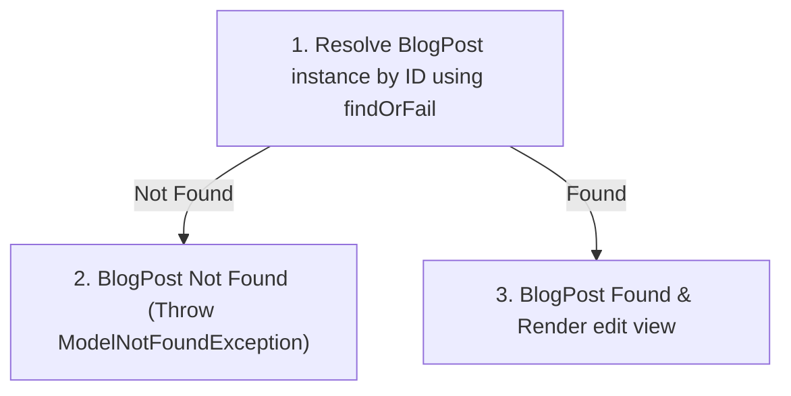
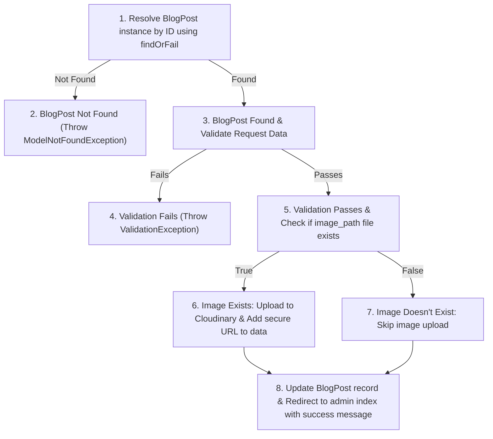
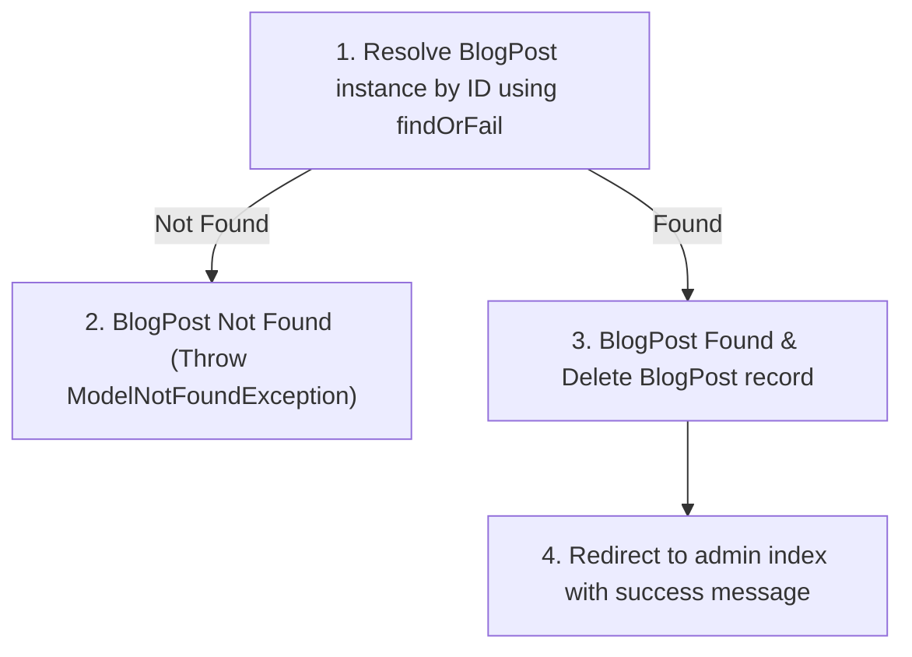

# Blog Feature - Basis Path Testing & White-Box Testing Document

This document outlines the Control Flow Graphs (CFGs), Cyclomatic Complexity calculations, Basis Path sets, and concrete test cases for the Blog feature. The target controllers analyzed are:
1. `BlogPostsController` (Public and admin blog CRUD operations, image uploads via Cloudinary, and validation logic)
2. `Admin\BlogController` (Admin blog posts listing)

---

## 1. Control Flow Models & Complexity Analysis

### 1.1 Admin\BlogController::index

#### Control Flow Graph (CFG)

#### Complexity Calculation
* **Predicate Nodes (P)**: 0
* **Cyclomatic Complexity V(G)**: $V(G) = P + 1 = 0 + 1 = 1$

#### Basis Paths
* **Path 1**: 1 (Fetch blog posts & render admin view)

---

### 1.2 BlogPostsController::index

#### Control Flow Graph (CFG)

#### Complexity Calculation
* **Predicate Nodes (P)**: 0
* **Cyclomatic Complexity V(G)**: $V(G) = P + 1 = 0 + 1 = 1$

#### Basis Paths
* **Path 1**: 1 (Fetch public blog posts & render view)

---

### 1.3 BlogPostsController::create

#### Control Flow Graph (CFG)

#### Complexity Calculation
* **Predicate Nodes (P)**: 0
* **Cyclomatic Complexity V(G)**: $V(G) = P + 1 = 0 + 1 = 1$

#### Basis Paths
* **Path 1**: 1 (Render create view)

---

### 1.4 BlogPostsController::store

#### Control Flow Graph (CFG)

#### Complexity Calculation
* **Predicate Nodes (P)**: 2
  * P1: Validation passes vs fails
  * P2: Image upload file is present vs not present
* **Cyclomatic Complexity V(G)**: $V(G) = P + 1 = 2 + 1 = 3$

#### Basis Paths
* **Path 1**: 1 -> 2 (Validation fails)
* **Path 2**: 1 -> 3 -> 4 -> 6 (Validation passes, image present, uploaded to Cloudinary, BlogPost created, redirect with success)
* **Path 3**: 1 -> 3 -> 5 -> 6 (Validation passes, image not present, BlogPost created with null image, redirect with success)

---

### 1.5 BlogPostsController::show

#### Control Flow Graph (CFG)

#### Complexity Calculation
* **Predicate Nodes (P)**: 1
  * P1: Blog post exists vs does not exist
* **Cyclomatic Complexity V(G)**: $V(G) = P + 1 = 1 + 1 = 2$

#### Basis Paths
* **Path 1**: 1 -> 2 (Blog post not found, return 404)
* **Path 2**: 1 -> 3 (Blog post found, render public detail view)

---

### 1.6 BlogPostsController::edit

#### Control Flow Graph (CFG)

#### Complexity Calculation
* **Predicate Nodes (P)**: 1
  * P1: Blog post exists vs does not exist
* **Cyclomatic Complexity V(G)**: $V(G) = P + 1 = 1 + 1 = 2$

#### Basis Paths
* **Path 1**: 1 -> 2 (Blog post not found, return 404)
* **Path 2**: 1 -> 3 (Blog post found, render admin edit view)

---

### 1.7 BlogPostsController::update

#### Control Flow Graph (CFG)

#### Complexity Calculation
* **Predicate Nodes (P)**: 3
  * P1: Blog post exists vs does not exist
  * P2: Validation passes vs fails
  * P3: Image upload file is present vs not present
* **Cyclomatic Complexity V(G)**: $V(G) = P + 1 = 3 + 1 = 4$

#### Basis Paths
* **Path 1**: 1 -> 2 (Blog post not found)
* **Path 2**: 1 -> 3 -> 4 (Blog post found, validation fails)
* **Path 3**: 1 -> 3 -> 5 -> 6 -> 8 (Blog post found, validation passes, image present, uploaded to Cloudinary, BlogPost updated, redirect with success)
* **Path 4**: 1 -> 3 -> 5 -> 7 -> 8 (Blog post found, validation passes, image not present, BlogPost updated without changing image, redirect with success)

---

### 1.8 BlogPostsController::destroy

#### Control Flow Graph (CFG)

#### Complexity Calculation
* **Predicate Nodes (P)**: 1
  * P1: Blog post exists vs does not exist
* **Cyclomatic Complexity V(G)**: $V(G) = P + 1 = 1 + 1 = 2$

#### Basis Paths
* **Path 1**: 1 -> 2 (Blog post not found)
* **Path 2**: 1 -> 3 -> 4 (Blog post found, deleted, redirect with success)

---

## 2. Test Cases

### 2.1 Admin\BlogController Test Cases

- Test Case ID & Path Covered: TC01 - Path: 1 (index)
- Description: Access the admin panel blog post management listing.
- Inputs / Preconditions:
  * Route: GET `/admin/blogs`
  * Precondition: Authenticated as Admin.
- Expected Output: Returns 200 OK rendering the view `admin.blog.index` populated with all blog post records ordered by `created_at` descending.

---

### 2.2 BlogPostsController Test Cases

- Test Case ID & Path Covered: TC02 - Path: 1 (index)
- Description: Access the public blog posts listing.
- Inputs / Preconditions:
  * Route: GET `/blog`
  * Precondition: Unauthenticated/Guest user or normal user.
- Expected Output: Returns 200 OK rendering the view `blog.index` populated with all blog post records ordered by `created_at` descending.

- Test Case ID & Path Covered: TC03 - Path: 1 (create)
- Description: Access the admin create blog post form.
- Inputs / Preconditions:
  * Route: GET `/admin/blogs/create`
  * Precondition: Authenticated as Admin.
- Expected Output: Returns 200 OK rendering the view `blog.create`.

- Test Case ID & Path Covered: TC04 - Path: 1 -> 2 (store)
- Description: Attempt to store a new blog post with invalid/missing title and content.
- Inputs / Preconditions:
  * Route: POST `/admin/blogs`
  * Precondition: Authenticated as Admin.
  * Inputs: `title = "Abc"`, `content = "Short"`, `image_path = null`
- Expected Output: Throws `ValidationException` due to `title` under 5 characters and `content` under 10 characters. Redirects back to the form with validation error messages.

- Test Case ID & Path Covered: TC05 - Path: 1 -> 3 -> 4 -> 6 (store)
- Description: Store a new blog post with valid inputs and a blog image uploaded.
- Inputs / Preconditions:
  * Route: POST `/admin/blogs`
  * Precondition: Authenticated as Admin. Cloudinary file upload is mocked to return a successful secure URL.
  * Inputs: `title = "Protecting Indonesian Mangroves"`, `content = "Mangroves are crucial coastal ecosystems that provide buffer zones against tsunamis and erosion."`, `image_path = [UploadedFile: mangrove.png]`
- Expected Output: Returns 302 redirect to `admin.blogs.index`. A new `BlogPost` record is created in the database containing the uploaded Cloudinary image URL. Flash session has success message "Blog berhasil ditambahkan!".

- Test Case ID & Path Covered: TC06 - Path: 1 -> 3 -> 5 -> 6 (store)
- Description: Store a new blog post with valid inputs and no image.
- Inputs / Preconditions:
  * Route: POST `/admin/blogs`
  * Precondition: Authenticated as Admin.
  * Inputs: `title = "Restoring Coral Reefs"`, `content = "Coral reef restoration involves transplanting fragments from healthy reefs to damaged areas."`, `image_path = null`
- Expected Output: Returns 302 redirect to `admin.blogs.index`. A new `BlogPost` record is created in the database with `image_path` set to `null`. Flash session has success message "Blog berhasil ditambahkan!".

- Test Case ID & Path Covered: TC07 - Path: 1 -> 2 (show)
- Description: View detail of a non-existent public blog post.
- Inputs / Preconditions:
  * Route: GET `/blog/99999`
  * Precondition: Unauthenticated/Guest user or normal user. Blog post ID 99999 does not exist in the database.
- Expected Output: Throws `ModelNotFoundException`, returning a 404 Not Found response.

- Test Case ID & Path Covered: TC08 - Path: 1 -> 3 (show)
- Description: Successfully view a public blog post's detail page.
- Inputs / Preconditions:
  * Route: GET `/blog/1`
  * Precondition: Unauthenticated/Guest user or normal user. Blog post ID 1 exists in the database.
- Expected Output: Returns 200 OK rendering the view `blog.show` populated with the target `BlogPost` model.

- Test Case ID & Path Covered: TC09 - Path: 1 -> 2 (edit)
- Description: Attempt to access the edit form of a non-existent blog post.
- Inputs / Preconditions:
  * Route: GET `/admin/blogs/99999/edit`
  * Precondition: Authenticated as Admin. Blog post ID 99999 does not exist in the database.
- Expected Output: Throws `ModelNotFoundException`, returning a 404 Not Found response.

- Test Case ID & Path Covered: TC10 - Path: 1 -> 3 (edit)
- Description: Access the edit form for an existing blog post.
- Inputs / Preconditions:
  * Route: GET `/admin/blogs/1/edit`
  * Precondition: Authenticated as Admin. Blog post ID 1 exists in the database.
- Expected Output: Returns 200 OK rendering the view `blog.edit` populated with the target `BlogPost` model.

- Test Case ID & Path Covered: TC11 - Path: 1 -> 2 (update)
- Description: Attempt to update a non-existent blog post.
- Inputs / Preconditions:
  * Route: PUT `/admin/blogs/99999`
  * Precondition: Authenticated as Admin. Blog post ID 99999 does not exist in the database.
- Expected Output: Throws `ModelNotFoundException`, returning a 404 Not Found response.

- Test Case ID & Path Covered: TC12 - Path: 1 -> 3 -> 4 (update)
- Description: Submit updates with invalid inputs on an existing blog post.
- Inputs / Preconditions:
  * Route: PUT `/admin/blogs/1`
  * Precondition: Authenticated as Admin. Blog post ID 1 exists in the database.
  * Inputs: `title = ""`, `content = "Short"`, `image_path = null`
- Expected Output: Throws `ValidationException` due to empty title and too-short content. Redirects back to the edit form with validation error messages.

- Test Case ID & Path Covered: TC13 - Path: 1 -> 3 -> 5 -> 6 -> 8 (update)
- Description: Successfully update an existing blog post with valid inputs and a new image file.
- Inputs / Preconditions:
  * Route: PUT `/admin/blogs/1`
  * Precondition: Authenticated as Admin. Blog post ID 1 exists. Cloudinary file upload is mocked to return a successful secure URL.
  * Inputs: `title = "Updated Protecting Indonesian Mangroves"`, `content = "Mangroves are crucial coastal ecosystems that provide buffer zones against tsunamis and erosion (Updated)."`, `image_path = [UploadedFile: new_mangrove.png]`
- Expected Output: Returns 302 redirect to `admin.blogs.index`. The `BlogPost` record with ID 1 is updated with the new title, content, and the new Cloudinary image URL. Flash session has success message "Blog berhasil diperbarui!".

- Test Case ID & Path Covered: TC14 - Path: 1 -> 3 -> 5 -> 7 -> 8 (update)
- Description: Successfully update an existing blog post with valid inputs and without changing the image.
- Inputs / Preconditions:
  * Route: PUT `/admin/blogs/1`
  * Precondition: Authenticated as Admin. Blog post ID 1 exists.
  * Inputs: `title = "Updated Protecting Indonesian Mangroves"`, `content = "Mangroves are crucial coastal ecosystems that provide buffer zones against tsunamis and erosion (Updated without image)."`, `image_path = null`
- Expected Output: Returns 302 redirect to `admin.blogs.index`. The `BlogPost` record with ID 1 is updated with the new title and content, leaving the existing `image_path` unchanged. Flash session has success message "Blog berhasil diperbarui!".

- Test Case ID & Path Covered: TC15 - Path: 1 -> 2 (destroy)
- Description: Attempt to delete a non-existent blog post.
- Inputs / Preconditions:
  * Route: DELETE `/admin/blogs/99999`
  * Precondition: Authenticated as Admin. Blog post ID 99999 does not exist in the database.
- Expected Output: Throws `ModelNotFoundException`, returning a 404 Not Found response.

- Test Case ID & Path Covered: TC16 - Path: 1 -> 3 -> 4 (destroy)
- Description: Successfully delete a blog post record from the database.
- Inputs / Preconditions:
  * Route: DELETE `/admin/blogs/1`
  * Precondition: Authenticated as Admin. Blog post ID 1 exists in the database.
- Expected Output: Returns 302 redirect to `admin.blogs.index`. The `BlogPost` record with ID 1 is deleted from the database. Flash session has success message "Blog berhasil dihapus!".
