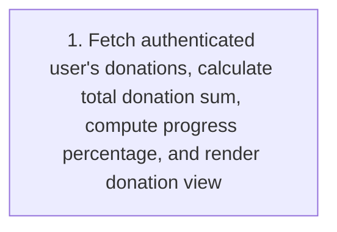
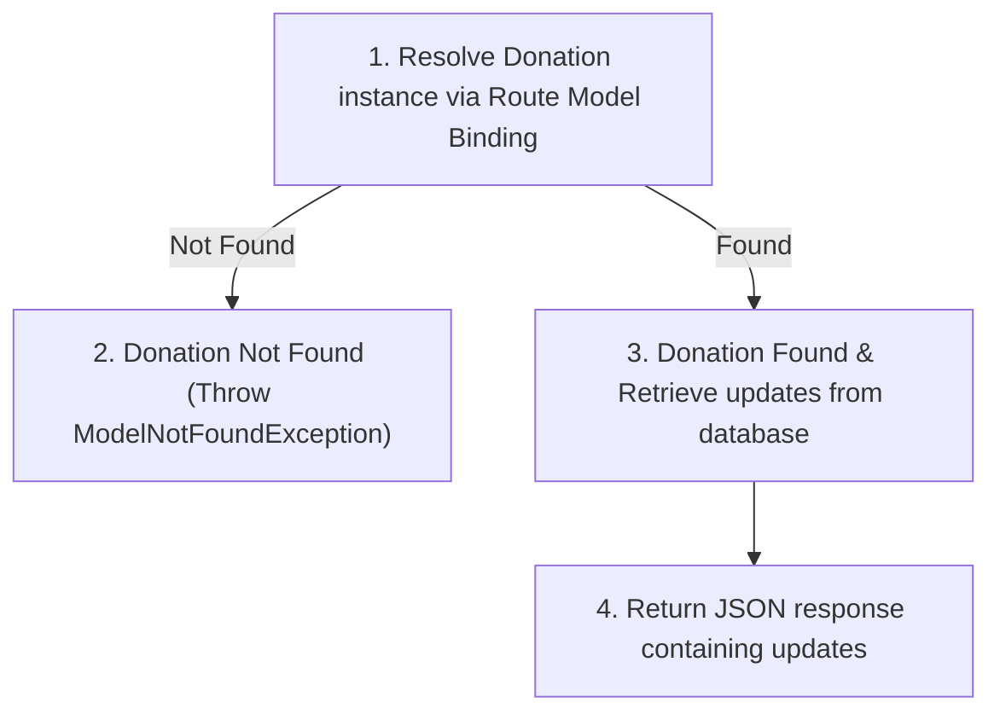
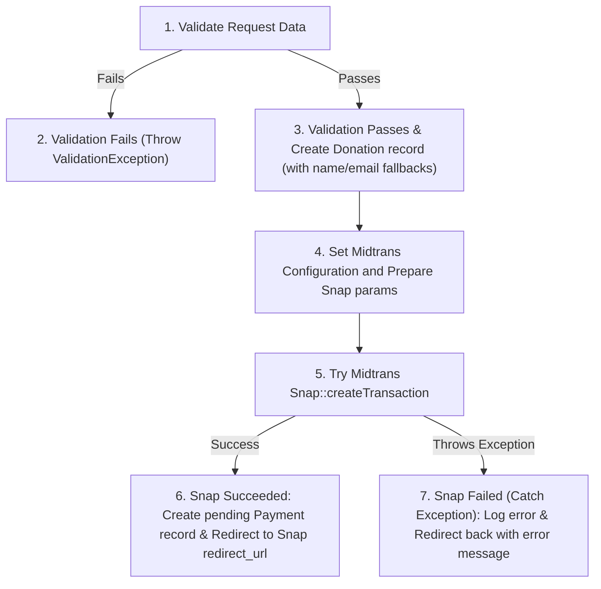
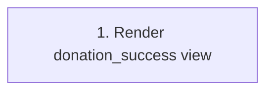
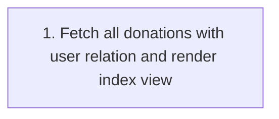
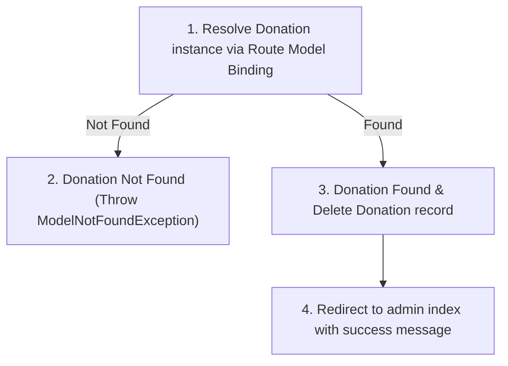
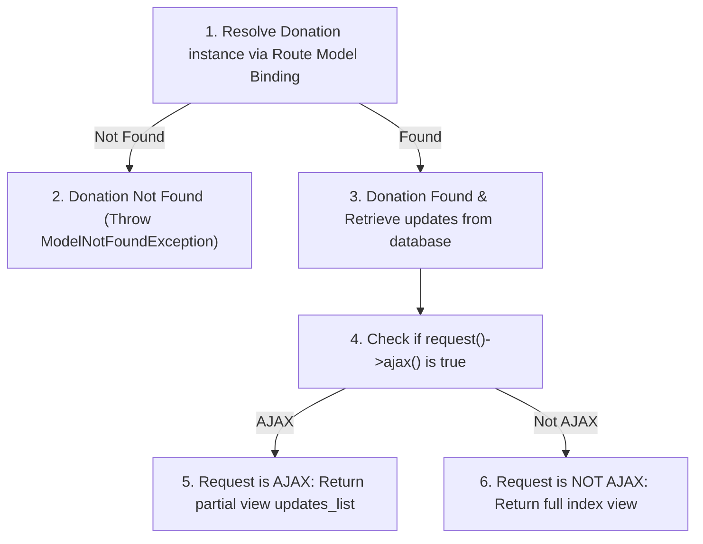
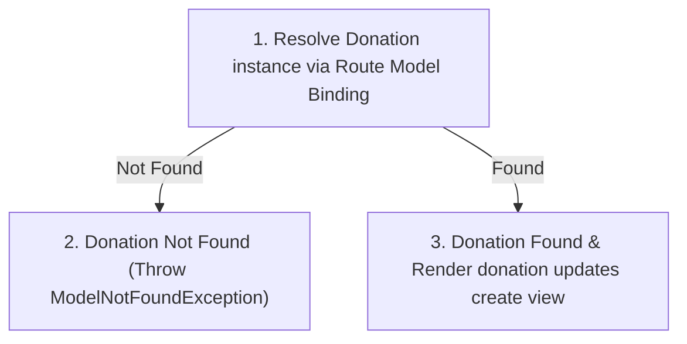
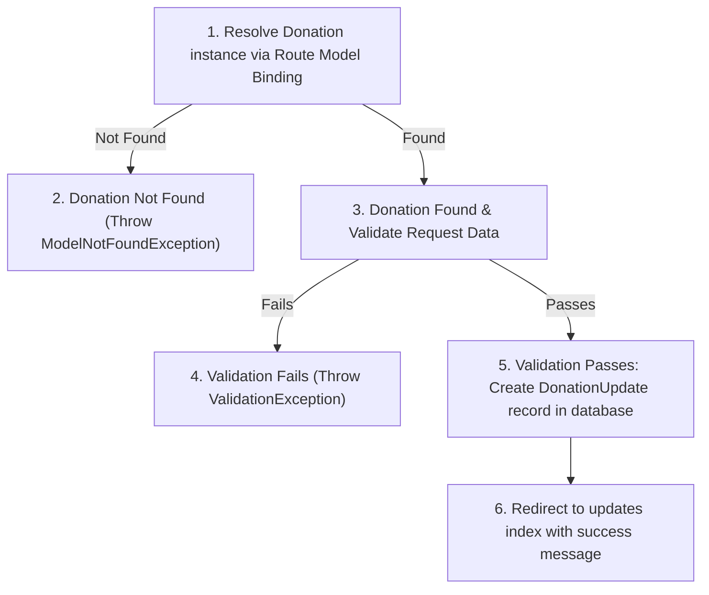

# Donation Feature - Basis Path Testing & White-Box Testing Document

This document outlines the Control Flow Graphs (CFGs), Cyclomatic Complexity calculations, Basis Path sets, and concrete test cases for the Donation feature. The target controllers analyzed are:
1. `DonationController` (Donations index, detail updates retrieval, payment gateway submission, success callback, and admin CRUD)
2. `DonationUpdateController` (Admin management of donation updates and progress reports)

---

## 1. Control Flow Models & Complexity Analysis

### 1.1 DonationController::index

#### Control Flow Graph (CFG)

#### Complexity Calculation
* **Predicate Nodes (P)**: 0
* **Cyclomatic Complexity V(G)**: $V(G) = P + 1 = 0 + 1 = 1$

#### Basis Paths
* **Path 1**: 1 (Retrieve data & render view)

---

### 1.2 DonationController::updates

#### Control Flow Graph (CFG)

#### Complexity Calculation
* **Predicate Nodes (P)**: 1
  * P1: Donation model exists vs does not exist
* **Cyclomatic Complexity V(G)**: $V(G) = P + 1 = 1 + 1 = 2$

#### Basis Paths
* **Path 1**: 1 -> 2 (Donation not found)
* **Path 2**: 1 -> 3 -> 4 (Donation found, returns JSON updates)

---

### 1.3 DonationController::store

#### Control Flow Graph (CFG)

#### Complexity Calculation
* **Predicate Nodes (P)**: 2
  * P1: Validation passes vs fails
  * P2: Midtrans Snap API call succeeds vs throws Exception
* **Cyclomatic Complexity V(G)**: $V(G) = P + 1 = 2 + 1 = 3$

#### Basis Paths
* **Path 1**: 1 -> 2 (Validation fails)
* **Path 2**: 1 -> 3 -> 4 -> 5 -> 6 (Validation passes, Snap succeeds, Payment created, Redirect to Midtrans)
* **Path 3**: 1 -> 3 -> 4 -> 5 -> 7 (Validation passes, Snap fails, Log error, Redirect back with error)

---

### 1.4 DonationController::success

#### Control Flow Graph (CFG)

#### Complexity Calculation
* **Predicate Nodes (P)**: 0
* **Cyclomatic Complexity V(G)**: $V(G) = P + 1 = 0 + 1 = 1$

#### Basis Paths
* **Path 1**: 1 (Render success view)

---

### 1.5 DonationController::adminIndex

#### Control Flow Graph (CFG)

#### Complexity Calculation
* **Predicate Nodes (P)**: 0
* **Cyclomatic Complexity V(G)**: $V(G) = P + 1 = 0 + 1 = 1$

#### Basis Paths
* **Path 1**: 1 (Fetch donations & render admin index)

---

### 1.6 DonationController::adminDestroy

#### Control Flow Graph (CFG)

#### Complexity Calculation
* **Predicate Nodes (P)**: 1
  * P1: Donation model exists vs does not exist
* **Cyclomatic Complexity V(G)**: $V(G) = P + 1 = 1 + 1 = 2$

#### Basis Paths
* **Path 1**: 1 -> 2 (Donation not found)
* **Path 2**: 1 -> 3 -> 4 (Donation found, deleted, redirected)

---

### 1.7 DonationUpdateController::index

#### Control Flow Graph (CFG)

#### Complexity Calculation
* **Predicate Nodes (P)**: 2
  * P1: Donation model exists vs does not exist
  * P2: Request is AJAX vs is not AJAX
* **Cyclomatic Complexity V(G)**: $V(G) = P + 1 = 2 + 1 = 3$

#### Basis Paths
* **Path 1**: 1 -> 2 (Donation not found)
* **Path 2**: 1 -> 3 -> 4 -> 5 (Donation found, AJAX request, return partial view)
* **Path 3**: 1 -> 3 -> 4 -> 6 (Donation found, standard request, return index view)

---

### 1.8 DonationUpdateController::create

#### Control Flow Graph (CFG)

#### Complexity Calculation
* **Predicate Nodes (P)**: 1
  * P1: Donation model exists vs does not exist
* **Cyclomatic Complexity V(G)**: $V(G) = P + 1 = 1 + 1 = 2$

#### Basis Paths
* **Path 1**: 1 -> 2 (Donation not found)
* **Path 2**: 1 -> 3 (Donation found, render create form view)

---

### 1.9 DonationUpdateController::store

#### Control Flow Graph (CFG)

#### Complexity Calculation
* **Predicate Nodes (P)**: 2
  * P1: Donation model exists vs does not exist
  * P2: Validation passes vs fails
* **Cyclomatic Complexity V(G)**: $V(G) = P + 1 = 2 + 1 = 3$

#### Basis Paths
* **Path 1**: 1 -> 2 (Donation not found)
* **Path 2**: 1 -> 3 -> 4 (Donation found, validation fails, throw ValidationException)
* **Path 3**: 1 -> 3 -> 5 -> 6 (Donation found, validation passes, create update record, redirect)

---

## 2. Test Cases

### 2.1 DonationController Test Cases

- Test Case ID & Path Covered: TC01 - Path: 1
- Description: Access the public donation dashboard page to view contribution list and overall progress.
- Inputs / Preconditions:
  * Route: GET `/donation`
  * Precondition: Authenticated as a normal user. Database has some donation records.
- Expected Output: Returns 200 OK rendering the `donation` view populated with the authenticated user's donation history, total donation sum, donation goal (100,000,000), and progress percentage.

- Test Case ID & Path Covered: TC02 - Path: 1 -> 2 (updates)
- Description: Retrieve updates for a non-existent donation ID.
- Inputs / Preconditions:
  * Route: GET `/donation/99999/updates`
  * Precondition: Authenticated as a normal user. Donation ID 99999 does not exist in the database.
- Expected Output: Throws `ModelNotFoundException`, returning a 404 Not Found response.

- Test Case ID & Path Covered: TC03 - Path: 1 -> 3 -> 4 (updates)
- Description: Retrieve updates for an existing donation.
- Inputs / Preconditions:
  * Route: GET `/donation/1/updates`
  * Precondition: Authenticated as a normal user. Donation ID 1 exists and has updates.
- Expected Output: Returns 200 OK with a JSON response containing an array of `DonationUpdate` models associated with Donation ID 1.

- Test Case ID & Path Covered: TC04 - Path: 1 -> 2 (store)
- Description: Submit a donation with an invalid amount (under minimum requirement).
- Inputs / Preconditions:
  * Route: POST `/donation`
  * Precondition: Authenticated as a normal user.
  * Inputs: `amount = 500`, `email = "test@example.com"`, `name = "John Doe"`, `message = "Support!"`
- Expected Output: Throws `ValidationException` and redirects back with validation errors indicating that `amount` must be at least 1000.

- Test Case ID & Path Covered: TC05 - Path: 1 -> 3 -> 4 -> 5 -> 6 (store)
- Description: Successfully submit a donation resulting in a successful Midtrans Snap transaction redirect.
- Inputs / Preconditions:
  * Route: POST `/donation`
  * Precondition: Authenticated as a normal user. Midtrans Snap API integration is mocked to return a successful payment URL and token.
  * Inputs: `amount = 50000`, `email = "user@example.com"`, `name = "Jane Doe"`, `message = "Good luck!"`
- Expected Output: Returns 302 redirect to the Midtrans Snap gateway URL. A new `Donation` record is created. A `Payment` record with order ID starting with 'DON-' and status 'pending' is stored in the database.

- Test Case ID & Path Covered: TC06 - Path: 1 -> 3 -> 4 -> 5 -> 7 (store)
- Description: Submit a valid donation but Midtrans Snap API call fails due to a connection or configuration exception.
- Inputs / Preconditions:
  * Route: POST `/donation`
  * Precondition: Authenticated as a normal user. Midtrans Snap API is mocked to throw an Exception.
  * Inputs: `amount = 50000`, `email = "user@example.com"`, `name = "Jane Doe"`, `message = "Good luck!"`
- Expected Output: Returns 302 redirecting back. Midtrans error is logged. Session flash message contains error: "Failed to create donation payment: <exception message>". No payment record is created.

- Test Case ID & Path Covered: TC07 - Path: 1 (success)
- Description: View the donation success landing page after a successful transaction.
- Inputs / Preconditions:
  * Route: GET `/donation/success`
  * Precondition: Authenticated as a normal user.
- Expected Output: Returns 200 OK rendering the `donation_success` view.

- Test Case ID & Path Covered: TC08 - Path: 1 (adminIndex)
- Description: Access all donations management page in admin panel.
- Inputs / Preconditions:
  * Route: GET `/admin/donations`
  * Precondition: Authenticated as Admin.
- Expected Output: Returns 200 OK rendering the `admin.donations.index` view populated with all donation records.

- Test Case ID & Path Covered: TC09 - Path: 1 -> 2 (adminDestroy)
- Description: Attempt to delete a non-existent donation.
- Inputs / Preconditions:
  * Route: DELETE `/admin/donations/99999`
  * Precondition: Authenticated as Admin. Donation ID 99999 does not exist.
- Expected Output: Throws `ModelNotFoundException`, returning a 404 Not Found response.

- Test Case ID & Path Covered: TC10 - Path: 1 -> 3 -> 4 (adminDestroy)
- Description: Successfully delete a donation record from the database.
- Inputs / Preconditions:
  * Route: DELETE `/admin/donations/1`
  * Precondition: Authenticated as Admin. Donation ID 1 exists.
- Expected Output: Returns 302 redirecting to `admin.donations.index`. The Donation record is deleted from the database. Flash session has success message "Donasi berhasil dihapus".

---

### 2.2 DonationUpdateController Test Cases

- Test Case ID & Path Covered: TC11 - Path: 1 -> 2 (index)
- Description: View donation updates for a non-existent donation.
- Inputs / Preconditions:
  * Route: GET `/admin/donations/99999/updates`
  * Precondition: Authenticated as Admin. Donation ID 99999 does not exist.
- Expected Output: Throws `ModelNotFoundException`, returning a 404 Not Found response.

- Test Case ID & Path Covered: TC12 - Path: 1 -> 3 -> 4 -> 5 (index)
- Description: Fetch donation updates list via AJAX request.
- Inputs / Preconditions:
  * Route: GET `/admin/donations/1/updates`
  * Precondition: Authenticated as Admin. Donation ID 1 exists. Request contains AJAX header `X-Requested-With: XMLHttpRequest`.
- Expected Output: Returns 200 OK rendering the partial view `admin.donation_updates.partials.updates_list`.

- Test Case ID & Path Covered: TC13 - Path: 1 -> 3 -> 4 -> 6 (index)
- Description: Access donation updates list via standard GET request.
- Inputs / Preconditions:
  * Route: GET `/admin/donations/1/updates`
  * Precondition: Authenticated as Admin. Donation ID 1 exists. Standard non-AJAX request.
- Expected Output: Returns 200 OK rendering the full view `admin.donation_updates.index`.

- Test Case ID & Path Covered: TC14 - Path: 1 -> 2 (create)
- Description: Attempt to access update creation page for a non-existent donation.
- Inputs / Preconditions:
  * Route: GET `/admin/donations/99999/updates/create`
  * Precondition: Authenticated as Admin. Donation ID 99999 does not exist.
- Expected Output: Throws `ModelNotFoundException`, returning a 404 Not Found response.

- Test Case ID & Path Covered: TC15 - Path: 1 -> 3 (create)
- Description: Access the form to create a new donation update.
- Inputs / Preconditions:
  * Route: GET `/admin/donations/1/updates/create`
  * Precondition: Authenticated as Admin. Donation ID 1 exists.
- Expected Output: Returns 200 OK rendering the view `admin.donation_updates.create`.

- Test Case ID & Path Covered: TC16 - Path: 1 -> 2 (store)
- Description: Attempt to store an update for a non-existent donation.
- Inputs / Preconditions:
  * Route: POST `/admin/donations/99999/updates`
  * Precondition: Authenticated as Admin. Donation ID 99999 does not exist.
  * Inputs: `title = "Restoring Mangroves"`, `description = "We planted 500 seedlings."`, `status = "In Progress"`
- Expected Output: Throws `ModelNotFoundException`, returning a 404 Not Found response.

- Test Case ID & Path Covered: TC17 - Path: 1 -> 3 -> 4 (store)
- Description: Submit a new donation update with invalid inputs causing validation errors.
- Inputs / Preconditions:
  * Route: POST `/admin/donations/1/updates`
  * Precondition: Authenticated as Admin. Donation ID 1 exists.
  * Inputs: `title = ""`, `description = ""`, `status = ""`
- Expected Output: Throws `ValidationException` and redirects back with validation errors for title, description, and status.

- Test Case ID & Path Covered: TC18 - Path: 1 -> 3 -> 5 -> 6 (store)
- Description: Successfully create and store a new donation update.
- Inputs / Preconditions:
  * Route: POST `/admin/donations/1/updates`
  * Precondition: Authenticated as Admin. Donation ID 1 exists.
  * Inputs: `title = "Initial Restoration Step"`, `description = "Cleaned up plastic trash along the coast."`, `status = "Completed"`
- Expected Output: Returns 302 redirect to `admin.donations.updates.index`. A new `DonationUpdate` record is successfully stored in the database. Flash session has success message "Update donasi berhasil ditambahkan".
