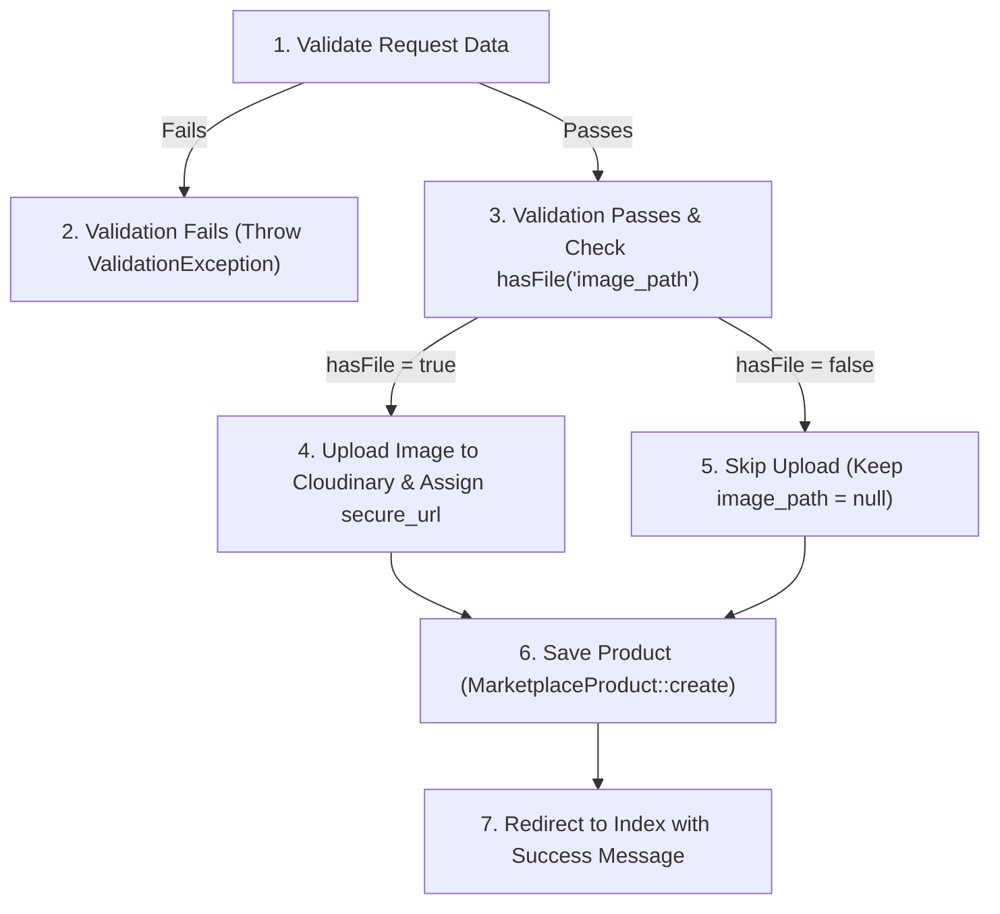
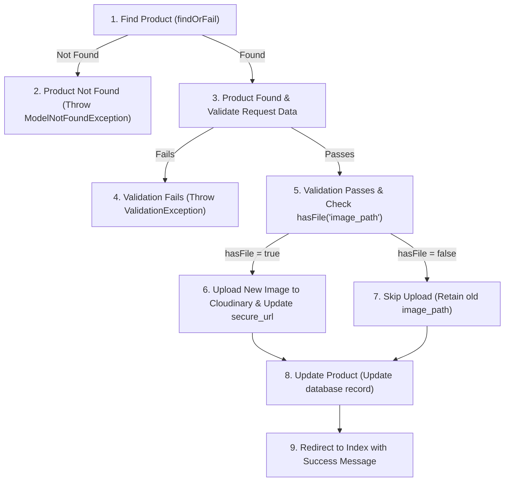
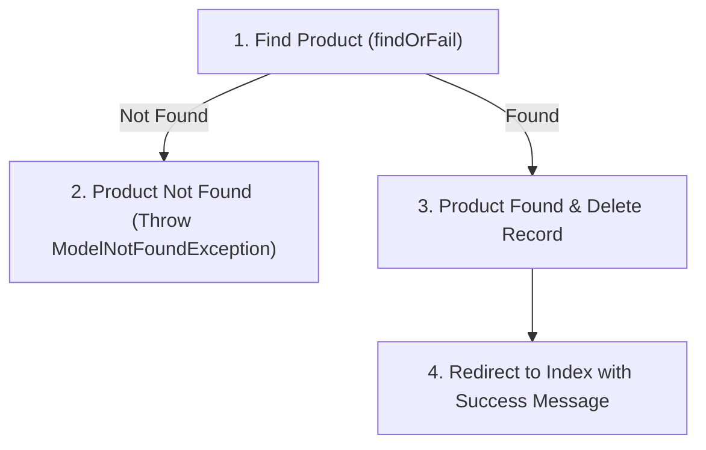
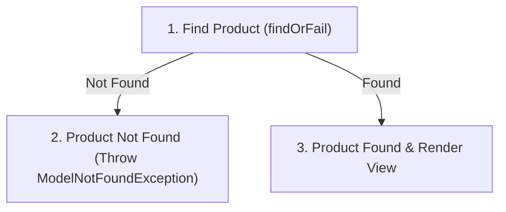
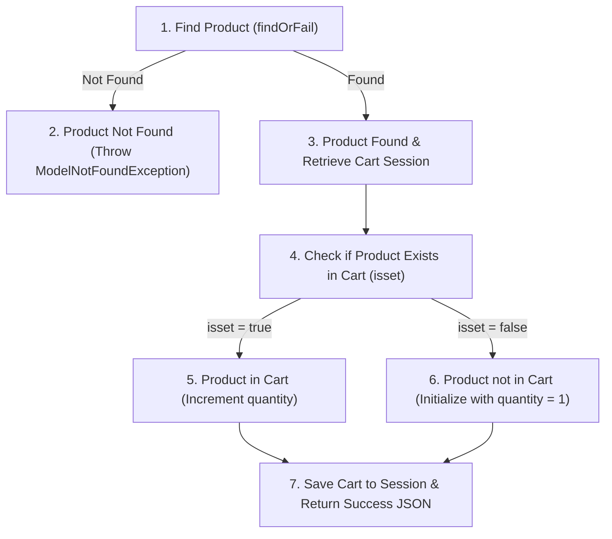
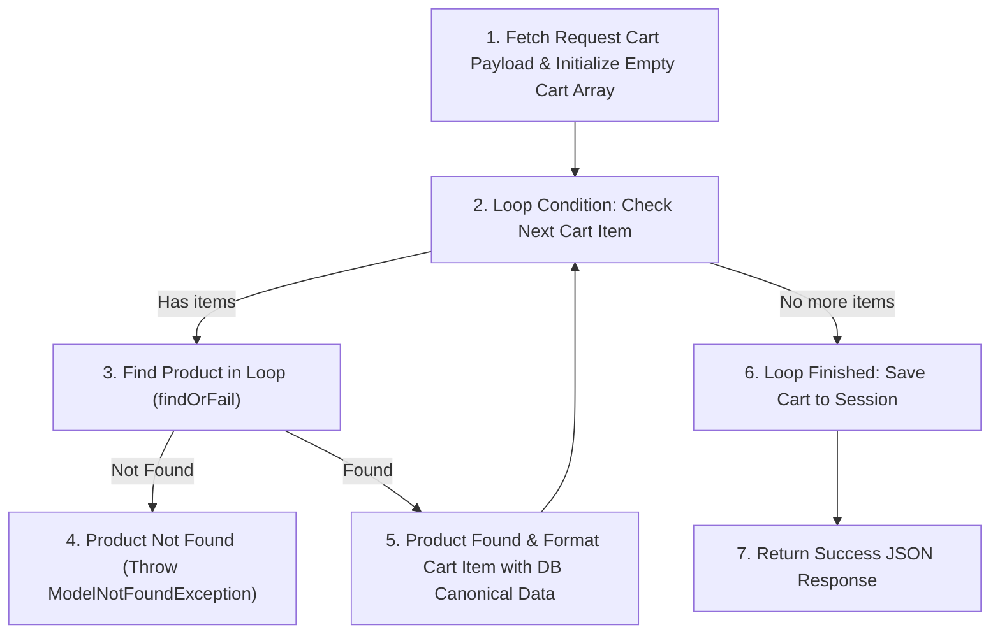
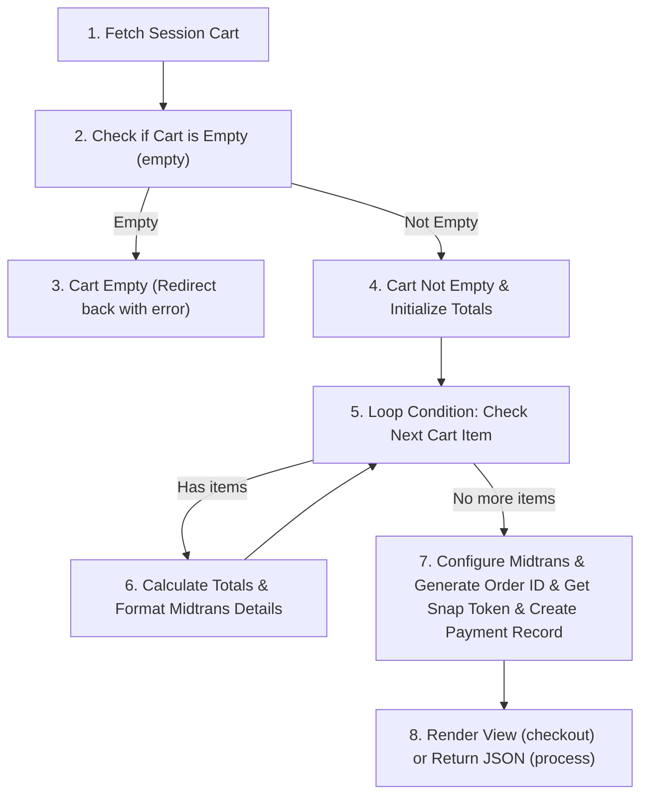
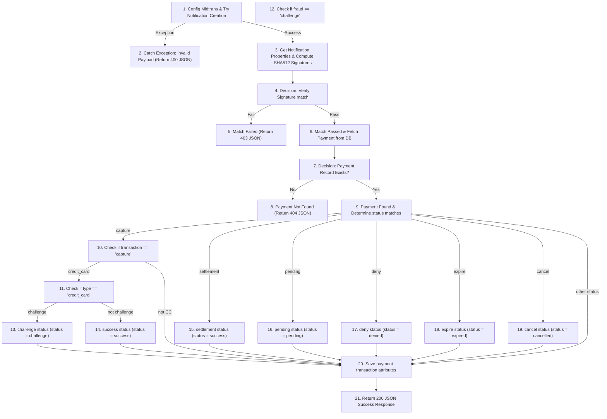

# Marketplace Feature - Basis Path Testing & White-Box Testing Document

This document outlines the Control Flow Graphs (CFGs), Cyclomatic Complexity calculations, Basis Path sets, and concrete test cases for the Marketplace feature. The target controllers analyzed are:
1. `MarketplaceProductController` (Product catalog and administration CRUD)
2. `CartController` (Session-based shopping cart and checkout)
3. `PaymentWebhookController` (Midtrans notification callback handler)

---

## 1. Control Flow Models & Complexity Analysis

### 1.1 MarketplaceProductController::store

#### Control Flow Graph (CFG)

#### Complexity Calculation
* **Predicate Nodes (P)**: 2
  * P1: Validation passes vs fails
  * P2: Request has file `image_path` vs does not
* **Cyclomatic Complexity V(G)**: $V(G) = P + 1 = 2 + 1 = 3$

#### Basis Paths
* **Path 1**: 1 -> 2 (Validation fails)
* **Path 2**: 1 -> 3 -> 4 -> 6 -> 7 (Validation passes, has image, uploads, saves, redirects)
* **Path 3**: 1 -> 3 -> 5 -> 6 -> 7 (Validation passes, no image, saves with null, redirects)

---

### 1.2 MarketplaceProductController::update

#### Control Flow Graph (CFG)

#### Complexity Calculation
* **Predicate Nodes (P)**: 3
  * P1: Product exists vs does not exist
  * P2: Validation passes vs fails
  * P3: Request has file `image_path` vs does not
* **Cyclomatic Complexity V(G)**: $V(G) = P + 1 = 3 + 1 = 4$

#### Basis Paths
* **Path 1**: 1 -> 2 (Product not found)
* **Path 2**: 1 -> 3 -> 4 (Product found, validation fails)
* **Path 3**: 1 -> 3 -> 5 -> 6 -> 8 -> 9 (Product found, validation passes, has new image, uploads, updates, redirects)
* **Path 4**: 1 -> 3 -> 5 -> 7 -> 8 -> 9 (Product found, validation passes, no new image, retains old path, updates, redirects)

---

### 1.3 MarketplaceProductController::destroy

#### Control Flow Graph (CFG)

#### Complexity Calculation
* **Predicate Nodes (P)**: 1
  * P1: Product exists vs does not exist
* **Cyclomatic Complexity V(G)**: $V(G) = P + 1 = 1 + 1 = 2$

#### Basis Paths
* **Path 1**: 1 -> 2 (Product not found)
* **Path 2**: 1 -> 3 -> 4 (Product found, deleted, redirected)

---

### 1.4 MarketplaceProductController::show & edit

#### Control Flow Graph (CFG)

#### Complexity Calculation
* **Predicate Nodes (P)**: 1
  * P1: Product exists vs does not exist
* **Cyclomatic Complexity V(G)**: $V(G) = P + 1 = 1 + 1 = 2$

#### Basis Paths
* **Path 1**: 1 -> 2 (Product not found)
* **Path 2**: 1 -> 3 (Product found, returns show/edit view)

---

### 1.5 CartController::add

#### Control Flow Graph (CFG)

#### Complexity Calculation
* **Predicate Nodes (P)**: 2
  * P1: Product exists vs does not exist
  * P2: Product is already in cart vs is not
* **Cyclomatic Complexity V(G)**: $V(G) = P + 1 = 2 + 1 = 3$

#### Basis Paths
* **Path 1**: 1 -> 2 (Product not found)
* **Path 2**: 1 -> 3 -> 4 -> 5 -> 7 (Product found, already in cart, increment quantity)
* **Path 3**: 1 -> 3 -> 4 -> 6 -> 7 (Product found, not in cart, initialize quantity = 1)

---

### 1.6 CartController::sync

#### Control Flow Graph (CFG)

#### Complexity Calculation
* **Predicate Nodes (P)**: 2
  * P1: Loop condition (has next item vs finished)
  * P2: Cart product exists vs does not exist
* **Cyclomatic Complexity V(G)**: $V(G) = P + 1 = 2 + 1 = 3$

#### Basis Paths
* **Path 1**: 1 -> 2 -> 6 -> 7 (Empty payload, loop doesn't execute, empty cart saved, returns JSON)
* **Path 2**: 1 -> 2 -> 3 -> 4 (Loop entered, product not found, terminates with 404)
* **Path 3**: 1 -> 2 -> 3 -> 5 -> (loop iterations) -> 2 -> 6 -> 7 (Loop entered, products exist, saves synced cart, returns JSON)

---

### 1.7 CartController::checkout & process

#### Control Flow Graph (CFG)

#### Complexity Calculation
* **Predicate Nodes (P)**: 2
  * P1: Cart is empty vs not empty
  * P2: Loop condition (has next item vs finished)
* **Cyclomatic Complexity V(G)**: $V(G) = P + 1 = 2 + 1 = 3$

#### Basis Paths
* **Path 1**: 1 -> 2 -> 3 (Cart empty, redirect with error message)
* **Path 2**: 1 -> 2 -> 4 -> 5 -> 6 -> 5 -> 7 -> 8 (Cart not empty, loop executes to calculate totals, handles payment creation & Midtrans Snap Token, returns output)
* *Note: Because Node 2 filters out empty carts, Node 5's loop condition is guaranteed to run at least once for non-empty carts. Syntactically, however, there are 2 predicate decisions, giving a V(G) of 3.*

---

### 1.8 PaymentWebhookController::handleNotification

#### Control Flow Graph (CFG)

#### Complexity Calculation
* **Predicate Nodes (P)**: 11
  1. Try/Catch Exception for Notification instantiation
  2. Signature verification match
  3. Payment record exists check
  4. `$transaction == 'capture'` check
  5. `$type == 'credit_card'` check
  6. `$fraud == 'challenge'` check
  7. `$transaction == 'settlement'` check
  8. `$transaction == 'pending'` check
  9. `$transaction == 'deny'` check
  10. `$transaction == 'expire'` check
  11. `$transaction == 'cancel'` check
* **Cyclomatic Complexity V(G)**: $V(G) = P + 1 = 11 + 1 = 12$

#### Basis Paths
* **Path 1**: 1 -> 2 (Notification throws exception)
* **Path 2**: 1 -> 3 -> 4 -> 5 (Signature verification fails)
* **Path 3**: 1 -> 3 -> 4 -> 6 -> 7 -> 8 (Payment record not found)
* **Path 4**: 1 -> 3 -> 4 -> 6 -> 7 -> 9 -> 10 -> 11 -> 12 -> 13 -> 20 -> 21 (Capture, Credit Card, Challenge)
* **Path 5**: 1 -> 3 -> 4 -> 6 -> 7 -> 9 -> 10 -> 11 -> 12 -> 14 -> 20 -> 21 (Capture, Credit Card, Success/Not Challenge)
* **Path 6**: 1 -> 3 -> 4 -> 6 -> 7 -> 9 -> 10 -> 20 -> 21 (Capture, Not Credit Card)
* **Path 7**: 1 -> 3 -> 4 -> 6 -> 7 -> 9 -> 15 -> 20 -> 21 (Settlement -> Success)
* **Path 8**: 1 -> 3 -> 4 -> 6 -> 7 -> 9 -> 16 -> 20 -> 21 (Pending -> Pending)
* **Path 9**: 1 -> 3 -> 4 -> 6 -> 7 -> 9 -> 17 -> 20 -> 21 (Deny -> Denied)
* **Path 10**: 1 -> 3 -> 4 -> 6 -> 7 -> 9 -> 18 -> 20 -> 21 (Expire -> Expired)
* **Path 11**: 1 -> 3 -> 4 -> 6 -> 7 -> 9 -> 19 -> 20 -> 21 (Cancel -> Cancelled)
* **Path 12**: 1 -> 3 -> 4 -> 6 -> 7 -> 9 -> 20 -> 21 (Other status, e.g. Refund -> Unchanged status)

---

## 2. Test Cases

### 2.1 MarketplaceProductController Test Cases

- Test Case ID & Path Covered: TC01 - Path: 1 -> 2 (index)
- Description: Access the public marketplace product listing page.
- Inputs / Preconditions:
  * Route: GET `/marketplace`
  * Precondition: Database has product records.
- Expected Output: Returns 200 OK rendering the `marketplace.index` view populated with the list of products sorted by creation time.

- Test Case ID & Path Covered: TC02 - Path: 1 (create)
- Description: Access the marketplace product creation form as an admin.
- Inputs / Preconditions:
  * Route: GET `/admin/marketplace/create`
  * Precondition: Authenticated as Admin.
- Expected Output: Returns 200 OK rendering the `marketplace.create` view containing the creation form.

- Test Case ID & Path Covered: TC03 - Path: 1 -> 2 (store)
- Description: Submit creation of a new product with invalid fields causing validation failure.
- Inputs / Preconditions:
  * Route: POST `/admin/marketplace`
  * Precondition: Authenticated as Admin.
  * Inputs: `name = ""`, `description = ""`, `price = ""`
- Expected Output: Throws `ValidationException`. Redirects back with errors for name, description, and price.

- Test Case ID & Path Covered: TC04 - Path: 1 -> 3 -> 4 -> 6 -> 7 (store)
- Description: Successfully create a product with valid details and an image upload.
- Inputs / Preconditions:
  * Route: POST `/admin/marketplace`
  * Precondition: Authenticated as Admin. Cloudinary API mocked.
  * Inputs: `name = "Recycled Ocean Bottle"`, `description = "High quality bottle made of ocean plastic"`, `price = 25000.00`, `image_path = <valid image file>`
- Expected Output: Returns 302 redirect to `admin.marketplace.index`. New product record stored in database with the secure Cloudinary image URL. Success message "Product berhasil ditambahkan!" set in session.

- Test Case ID & Path Covered: TC05 - Path: 1 -> 3 -> 5 -> 6 -> 7 (store)
- Description: Successfully create a product with valid details and no image upload.
- Inputs / Preconditions:
  * Route: POST `/admin/marketplace`
  * Precondition: Authenticated as Admin.
  * Inputs: `name = "Recycled Notebook"`, `description = "Notebook made from waste cardboards"`, `price = 15000.00`, `image_path = null`
- Expected Output: Returns 302 redirect to `admin.marketplace.index`. New product record stored in database with `image_path = null`. Success message "Product berhasil ditambahkan!" set in session.

- Test Case ID & Path Covered: TC06 - Path: 1 -> 2 (show)
- Description: Try to view details of a product that does not exist.
- Inputs / Preconditions:
  * Route: GET `/marketplace/99999`
  * Precondition: ID 99999 does not exist in `marketplace_products`.
- Expected Output: Throws `ModelNotFoundException`, returning 404 Not Found response.

- Test Case ID & Path Covered: TC07 - Path: 1 -> 3 (show)
- Description: Successfully view details of an existing product.
- Inputs / Preconditions:
  * Route: GET `/marketplace/1`
  * Precondition: Product ID 1 exists in `marketplace_products`.
- Expected Output: Returns 200 OK rendering the `marketplace.show` view containing the product's details.

- Test Case ID & Path Covered: TC08 - Path: 1 -> 2 (edit)
- Description: Access edit product form for a non-existent product ID.
- Inputs / Preconditions:
  * Route: GET `/admin/marketplace/99999/edit`
  * Precondition: Authenticated as Admin. ID 99999 does not exist.
- Expected Output: Throws `ModelNotFoundException`, returning 404 Not Found response.

- Test Case ID & Path Covered: TC09 - Path: 1 -> 3 (edit)
- Description: Access edit product form for an existing product ID.
- Inputs / Preconditions:
  * Route: GET `/admin/marketplace/1/edit`
  * Precondition: Authenticated as Admin. Product ID 1 exists.
- Expected Output: Returns 200 OK rendering the `marketplace.edit` view populated with details of product ID 1.

- Test Case ID & Path Covered: TC10 - Path: 1 -> 2 (update)
- Description: Try to update details of a non-existent product ID.
- Inputs / Preconditions:
  * Route: PUT `/admin/marketplace/99999`
  * Precondition: Authenticated as Admin. ID 99999 does not exist.
  * Inputs: `name = "Updated Name"`, `description = "Updated Desc"`, `price = 30000.00`
- Expected Output: Throws `ModelNotFoundException`, returning 404 Not Found response.

- Test Case ID & Path Covered: TC11 - Path: 1 -> 3 -> 4 (update)
- Description: Try to update product with invalid inputs causing validation failure.
- Inputs / Preconditions:
  * Route: PUT `/admin/marketplace/1`
  * Precondition: Authenticated as Admin. Product ID 1 exists.
  * Inputs: `name = "Eco"`, `description = ""`, `price = -10.00`
- Expected Output: Throws `ValidationException`. Redirects back with errors for name, description, and price.

- Test Case ID & Path Covered: TC12 - Path: 1 -> 3 -> 5 -> 6 -> 8 -> 9 (update)
- Description: Update product details and replace the old image with a new image upload.
- Inputs / Preconditions:
  * Route: PUT `/admin/marketplace/1`
  * Precondition: Authenticated as Admin. Product ID 1 exists with initial image `old_image.png`. Cloudinary API mocked.
  * Inputs: `name = "Eco Bottle Redux"`, `description = "Upgraded ocean-waste bottle"`, `price = 35000.00`, `image_path = <valid new image file>`
- Expected Output: Returns 302 redirect to `admin.marketplace.index`. Database record updated with the new details and the newly uploaded Cloudinary image URL. Success message "Product berhasil diperbarui!" set in session.

- Test Case ID & Path Covered: TC13 - Path: 1 -> 3 -> 5 -> 7 -> 8 -> 9 (update)
- Description: Update product details without replacing the existing image.
- Inputs / Preconditions:
  * Route: PUT `/admin/marketplace/1`
  * Precondition: Authenticated as Admin. Product ID 1 exists with image URL `https://res.cloudinary.com/.../bottle.jpg`.
  * Inputs: `name = "Eco Bottle Redux"`, `description = "Upgraded ocean-waste bottle"`, `price = 35000.00`, `image_path = null`
- Expected Output: Returns 302 redirect to `admin.marketplace.index`. Database record updated with the new details while keeping the old image URL `https://res.cloudinary.com/.../bottle.jpg` unchanged. Success message "Product berhasil diperbarui!" set in session.

- Test Case ID & Path Covered: TC14 - Path: 1 -> 2 (destroy)
- Description: Try to delete a non-existent product ID.
- Inputs / Preconditions:
  * Route: DELETE `/admin/marketplace/99999`
  * Precondition: Authenticated as Admin. ID 99999 does not exist.
- Expected Output: Throws `ModelNotFoundException`, returning 404 Not Found response.

- Test Case ID & Path Covered: TC15 - Path: 1 -> 3 -> 4 (destroy)
- Description: Successfully delete an existing product.
- Inputs / Preconditions:
  * Route: DELETE `/admin/marketplace/1`
  * Precondition: Authenticated as Admin. Product ID 1 exists.
- Expected Output: Returns 302 redirect to `admin.marketplace.index`. Product ID 1 deleted from the database. Success message "Product berhasil dihapus!" set in session.

---

### 2.2 CartController Test Cases

- Test Case ID & Path Covered: TC16 - Path: 1 -> 2 (add)
- Description: Attempt to add a non-existent product ID to the cart.
- Inputs / Preconditions:
  * Route: POST `/cart/add`
  * Precondition: Authenticated as User. ID 99999 does not exist.
  * Input: `product_id = 99999`
- Expected Output: Throws `ModelNotFoundException`, returning 404 Not Found response.

- Test Case ID & Path Covered: TC17 - Path: 1 -> 3 -> 4 -> 5 -> 7 (add)
- Description: Add a product that is already present in the cart, incrementing its quantity.
- Inputs / Preconditions:
  * Route: POST `/cart/add`
  * Precondition: Authenticated as User. Product ID 1 exists. Session cart currently contains `[1 => ['name' => 'Eco Bottle', 'quantity' => 1, 'price' => 15000.00, 'image' => 'bottle.jpg']]`.
  * Input: `product_id = 1`
- Expected Output: Returns 200 OK JSON success: `{"status": "success", "message": "Eco Bottle added to cart!"}`. Session cart updated so that product ID 1 quantity is `2`.

- Test Case ID & Path Covered: TC18 - Path: 1 -> 3 -> 4 -> 6 -> 7 (add)
- Description: Add a new product to the cart (initialize item with quantity 1).
- Inputs / Preconditions:
  * Route: POST `/cart/add`
  * Precondition: Authenticated as User. Product ID 1 exists. Session cart is empty `[]`.
  * Input: `product_id = 1`
- Expected Output: Returns 200 OK JSON success: `{"status": "success", "message": "Eco Bottle added to cart!"}`. Session cart updated to include product ID 1 details with quantity `1`.

- Test Case ID & Path Covered: TC19 - Path: 1 -> 2 -> 6 -> 7 (sync)
- Description: Sync an empty frontend cart to session.
- Inputs / Preconditions:
  * Route: POST `/cart/sync`
  * Precondition: Authenticated as User.
  * Input: `cart = []`
- Expected Output: Returns 200 OK JSON success: `{"status": "success", "message": "Cart synced successfully!"}`. Session cart is set to `[]`.

- Test Case ID & Path Covered: TC20 - Path: 1 -> 2 -> 3 -> 4 (sync)
- Description: Attempt to sync a cart containing a non-existent product ID.
- Inputs / Preconditions:
  * Route: POST `/cart/sync`
  * Precondition: Authenticated as User.
  * Input: `cart = [['id' => 99999, 'quantity' => 2]]`
- Expected Output: Throws `ModelNotFoundException`, returning 404 Not Found response. Session cart is not modified.

- Test Case ID & Path Covered: TC21 - Path: 1 -> 2 -> 3 -> 5 -> 2 -> 6 -> 7 (sync)
- Description: Sync a cart containing items, and verify canonical database prices are used to block price manipulation.
- Inputs / Preconditions:
  * Route: POST `/cart/sync`
  * Precondition: Authenticated as User. Product ID 1 exists in DB with canonical price `15000.00` and name `"Eco Bottle"`.
  * Input: `cart = [['id' => 1, 'quantity' => 3, 'price' => 1.00, 'name' => 'Faked Cheap Bottle']]`
- Expected Output: Returns 200 OK JSON success: `{"status": "success", "message": "Cart synced successfully!"}`. Session cart updated to include product ID 1 with quantity `3`, price `15000.00` (ignoring the payload's manipulated price), and name `"Eco Bottle"` (ignoring the payload's name modification).

- Test Case ID & Path Covered: TC22 - Path: 1 -> 2 -> 3 (checkout)
- Description: Try to view the checkout page with an empty cart.
- Inputs / Preconditions:
  * Route: GET `/cart/checkout`
  * Precondition: Authenticated as User. Session cart is empty `[]`.
- Expected Output: Returns 302 redirect to `marketplace.index` with flash error message "Cart is empty!".

- Test Case ID & Path Covered: TC23 - Path: 1 -> 2 -> 4 -> 5 -> 6 -> 5 -> 7 -> 8 (checkout)
- Description: View the checkout page with items, producing a Midtrans snap token and payment record.
- Inputs / Preconditions:
  * Route: GET `/cart/checkout`
  * Precondition: Authenticated as User. Session cart has `[1 => ['name' => 'Eco Bottle', 'quantity' => 2, 'price' => 15000.00, 'image' => 'bottle.jpg']]`. Midtrans Snap API mocked to return snap token `"snap-token-abc"`.
- Expected Output: Returns 200 OK rendering the `checkout` view with `cart`, `totalAmount = 30000.00`, and `snapToken = "snap-token-abc"`. DB has a new pending `Payment` record with status `pending`, type `marketplace`, and `gross_amount = 30000.00`.

- Test Case ID & Path Covered: TC24 - Path: 1 -> 2 -> 3 (process)
- Description: Submit checkout process request with an empty cart.
- Inputs / Preconditions:
  * Route: POST `/cart/process`
  * Precondition: Authenticated as User. Session cart is empty `[]`.
- Expected Output: Returns 302 redirect to `marketplace.index` with flash error message "Cart is empty!".

- Test Case ID & Path Covered: TC25 - Path: 1 -> 2 -> 4 -> 5 -> 6 -> 5 -> 7 -> 8 (process)
- Description: Process checkout with items in cart, returning JSON snap token.
- Inputs / Preconditions:
  * Route: POST `/cart/process`
  * Precondition: Authenticated as User. Session cart has `[1 => ['name' => 'Eco Bottle', 'quantity' => 2, 'price' => 15000.00, 'image' => 'bottle.jpg']]`. Midtrans Snap API mocked to return snap token `"snap-token-xyz"`.
- Expected Output: Returns 200 OK JSON response: `{"status": "success", "snap_token": "snap-token-xyz"}`. DB has a new pending `Payment` record with status `pending`, type `marketplace`, and `gross_amount = 30000.00`.

---

### 2.3 Admin/MarketplaceController Test Cases

- Test Case ID & Path Covered: TC26 - Path: 1 -> 2 (index)
- Description: Access admin marketplace index listing.
- Inputs / Preconditions:
  * Route: GET `/admin/marketplace`
  * Precondition: Authenticated as Admin.
- Expected Output: Returns 200 OK rendering the `admin.marketplace.index` view populated with the list of products sorted by creation date.

---

### 2.4 PaymentWebhookController Test Cases

- Test Case ID & Path Covered: TC27 - Path: 1 -> 2
- Description: Midtrans webhook receives a malformed payload failing to instantiate the Notification class.
- Inputs / Preconditions:
  * Route: POST `/payment/notification`
  * Input: Invalid, non-JSON or missing body.
- Expected Output: Returns 400 Bad Request JSON response: `{"status": "error", "message": "Invalid notification payload"}`.

- Test Case ID & Path Covered: TC28 - Path: 1 -> 3 -> 4 -> 5
- Description: Webhook signature verification fails (manipulated or incorrect signature).
- Inputs / Preconditions:
  * Route: POST `/payment/notification`
  * Input: Valid format payload but with incorrect signature key.
- Expected Output: Returns 403 Forbidden JSON response: `{"status": "error", "message": "Invalid signature key"}`.

- Test Case ID & Path Covered: TC29 - Path: 1 -> 3 -> 4 -> 6 -> 7 -> 8
- Description: Webhook verification succeeds but the payment record does not exist in the database.
- Inputs / Preconditions:
  * Route: POST `/payment/notification`
  * Inputs: Correct signature key for order ID `MKT-UNKNOWN`. No payment record in DB matches `MKT-UNKNOWN`.
- Expected Output: Returns 404 Not Found JSON response: `{"status": "error", "message": "Payment record not found"}`.

- Test Case ID & Path Covered: TC30 - Path: 1 -> 3 -> 4 -> 6 -> 7 -> 9 -> 10 -> 11 -> 12 -> 13 -> 20 -> 21
- Description: Webhook processes a challenge status for a Credit Card capture transaction.
- Inputs / Preconditions:
  * Route: POST `/payment/notification`
  * Preconditions: Payment record with order ID `MKT-CC-CHALLENGE` exists in DB with pending status.
  * Inputs: `order_id = "MKT-CC-CHALLENGE"`, `transaction_status = "capture"`, `payment_type = "credit_card"`, `fraud_status = "challenge"`, valid signature key.
- Expected Output: Returns 200 OK JSON success: `{"status": "success", "message": "Notification handled"}`. Database payment status updated to `challenge`.

- Test Case ID & Path Covered: TC31 - Path: 1 -> 3 -> 4 -> 6 -> 7 -> 9 -> 10 -> 11 -> 12 -> 14 -> 20 -> 21
- Description: Webhook processes a successful Credit Card capture transaction (not challenged).
- Inputs / Preconditions:
  * Route: POST `/payment/notification`
  * Preconditions: Payment record with order ID `MKT-CC-SUCCESS` exists in DB with pending status.
  * Inputs: `order_id = "MKT-CC-SUCCESS"`, `transaction_status = "capture"`, `payment_type = "credit_card"`, `fraud_status = "accept"`, valid signature key.
- Expected Output: Returns 200 OK JSON success. Database payment status updated to `success`.

- Test Case ID & Path Covered: TC32 - Path: 1 -> 3 -> 4 -> 6 -> 7 -> 9 -> 10 -> 20 -> 21
- Description: Webhook processes a capture transaction of a non-credit-card payment type.
- Inputs / Preconditions:
  * Route: POST `/payment/notification`
  * Preconditions: Payment record with order ID `MKT-NONCC-CAPTURE` exists in DB with pending status.
  * Inputs: `order_id = "MKT-NONCC-CAPTURE"`, `transaction_status = "capture"`, `payment_type = "bank_transfer"`, valid signature key.
- Expected Output: Returns 200 OK JSON success. Database payment status remains `pending` (unchanged).

- Test Case ID & Path Covered: TC33 - Path: 1 -> 3 -> 4 -> 6 -> 7 -> 9 -> 15 -> 20 -> 21
- Description: Webhook processes a transaction settlement.
- Inputs / Preconditions:
  * Route: POST `/payment/notification`
  * Preconditions: Payment record with order ID `MKT-SETTLEMENT` exists in DB with pending status.
  * Inputs: `order_id = "MKT-SETTLEMENT"`, `transaction_status = "settlement"`, valid signature key.
- Expected Output: Returns 200 OK JSON success. Database payment status updated to `success`.

- Test Case ID & Path Covered: TC34 - Path: 1 -> 3 -> 4 -> 6 -> 7 -> 9 -> 16 -> 20 -> 21
- Description: Webhook processes a pending transaction status.
- Inputs / Preconditions:
  * Route: POST `/payment/notification`
  * Preconditions: Payment record with order ID `MKT-PENDING` exists in DB with pending status.
  * Inputs: `order_id = "MKT-PENDING"`, `transaction_status = "pending"`, valid signature key.
- Expected Output: Returns 200 OK JSON success. Database payment status set to `pending`.

- Test Case ID & Path Covered: TC35 - Path: 1 -> 3 -> 4 -> 6 -> 7 -> 9 -> 17 -> 20 -> 21
- Description: Webhook processes a denied transaction status.
- Inputs / Preconditions:
  * Route: POST `/payment/notification`
  * Preconditions: Payment record with order ID `MKT-DENY` exists in DB with pending status.
  * Inputs: `order_id = "MKT-DENY"`, `transaction_status = "deny"`, valid signature key.
- Expected Output: Returns 200 OK JSON success. Database payment status updated to `denied`.

- Test Case ID & Path Covered: TC36 - Path: 1 -> 3 -> 4 -> 6 -> 7 -> 9 -> 18 -> 20 -> 21
- Description: Webhook processes an expired transaction status.
- Inputs / Preconditions:
  * Route: POST `/payment/notification`
  * Preconditions: Payment record with order ID `MKT-EXPIRE` exists in DB with pending status.
  * Inputs: `order_id = "MKT-EXPIRE"`, `transaction_status = "expire"`, valid signature key.
- Expected Output: Returns 200 OK JSON success. Database payment status updated to `expired`.

- Test Case ID & Path Covered: TC37 - Path: 1 -> 3 -> 4 -> 6 -> 7 -> 9 -> 19 -> 20 -> 21
- Description: Webhook processes a cancelled transaction status.
- Inputs / Preconditions:
  * Route: POST `/payment/notification`
  * Preconditions: Payment record with order ID `MKT-CANCEL` exists in DB with pending status.
  * Inputs: `order_id = "MKT-CANCEL"`, `transaction_status = "cancel"`, valid signature key.
- Expected Output: Returns 200 OK JSON success. Database payment status updated to `cancelled`.

- Test Case ID & Path Covered: TC38 - Path: 1 -> 3 -> 4 -> 6 -> 7 -> 9 -> 20 -> 21
- Description: Webhook processes an unsupported/unhandled transaction status.
- Inputs / Preconditions:
  * Route: POST `/payment/notification`
  * Preconditions: Payment record with order ID `MKT-REFUND` exists in DB with pending status.
  * Inputs: `order_id = "MKT-REFUND"`, `transaction_status = "refund"`, valid signature key.
- Expected Output: Returns 200 OK JSON success. Database payment status remains `pending` (unchanged).
